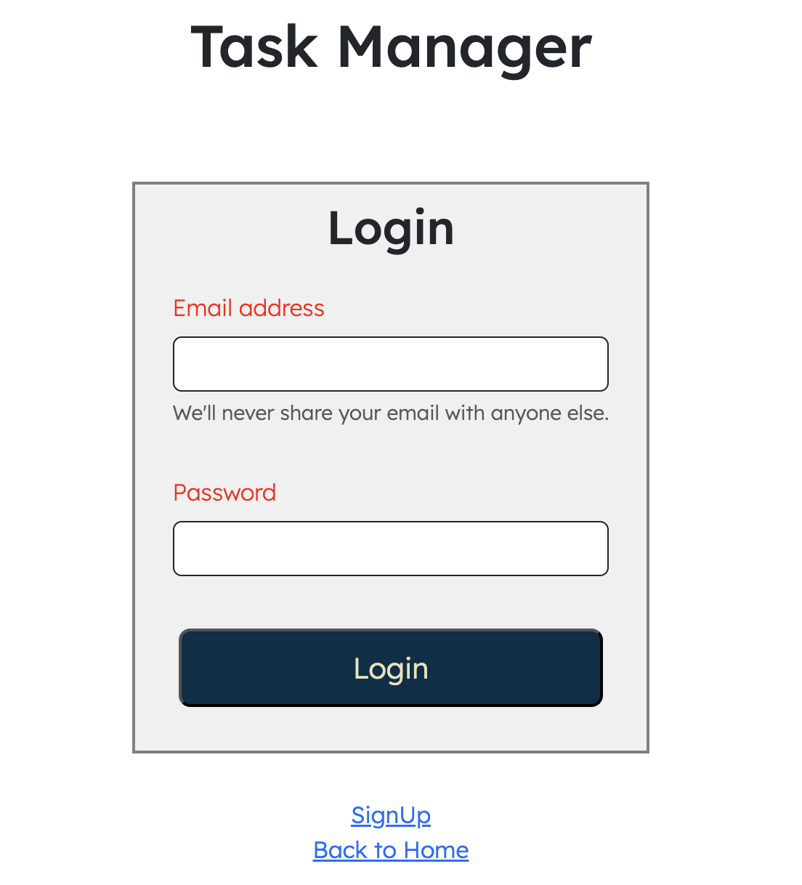
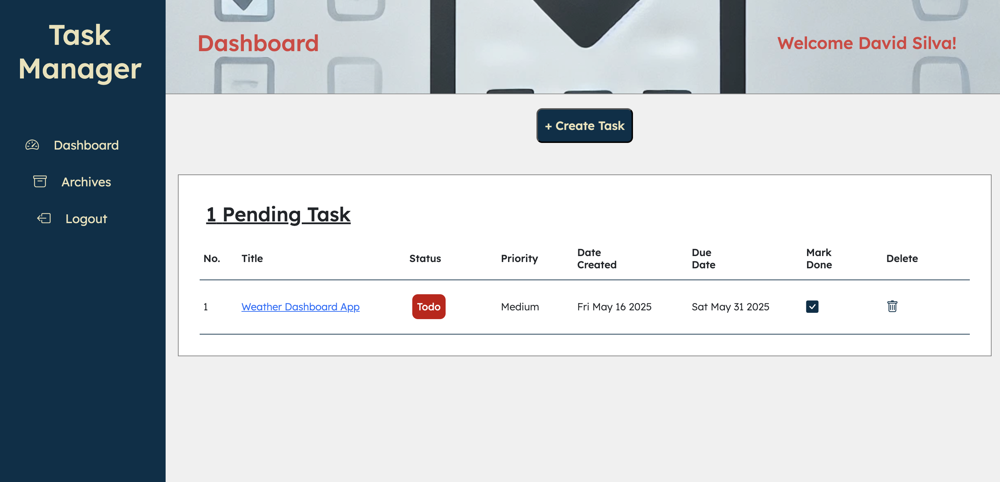
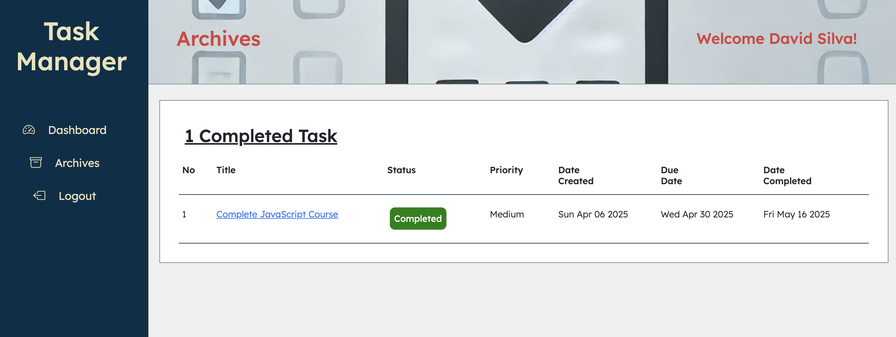

# **Task Manager** 

[](https://opensource.org/licenses/MIT)

## Project Description
**Task Manager** is a full-stack productivity app that helps users organize their tasks, manage priorities, and keep track of deadlines. Users can create an account, log in, add tasks, update task details, mark tasks as completed, and delete tasks. Completed tasks can also be archived for future reference.

This project was developed as a practical tool for managing daily responsibilities and enhancing focus through a clean and responsive UI.


The project was developed based on the MERN stack framework using several Code libraries and packages. The front-end was developed using *React*, including the *React-Router*. The backend was developed using *Apollo Server (GraphQL)*, *Node.js* and *Express.js*. For the database, the project utilized *MongoDB* and the *Mongoose ODM*. Other packages utilized include `bcrypt`, `JWT`, `dotenv`, `jsonwebtoken`, `apollo-server-express` e.t.c. CSS was based mostly on *Bootstrap 5*, including *Bootstrap Icons*.


## Link to Webpage
Click [here](https://limitless-savannah-15649-a45e9921acb2.herokuapp.com/) to view the application

## 📌 Features

- User registration and authentication (JWT-based)
- Create, update, delete tasks
- Set task priority and due dates
- View task details
- Mark tasks as completed
- Archive of completed tasks
- Responsive design (Bootstrap 5)
- Fully integrated with MongoDB via Mongoose

---

## 🧰 Tech Stack

| Tech | Description |
|------|-------------|
| **Frontend** | React, React Router, Bootstrap 5 |
| **Backend** | Node.js, Express.js |
| **API** | GraphQL with Apollo Server & Apollo Client |
| **Database** | MongoDB with Mongoose ODM |
| **Auth** | bcrypt, JWT |
| **Deployment** | Heroku |

---

## 📸 Screenshots

### Login  


### Dashboard  


### Task Page  


### Archives 


---

## 📦 Installation

To run the application locally:

### 1. Clone the Repository
```bash
git clone https://https://github.com/anayoifediora/Task_Manager.git
cd Task_Manager
```
### 2. Install Dependencies
```bash
npm install
cd client && npm install
```
### 3. Environment Variables
Create a .env file in the root and add:
```ini
JWT_SECRET=your_jwt_secret_key
MONGODB_URI=your_mongodb_connection_string
```
### 4. Run the App (Dev Mode)
```bash
npm run develop
```

## 📖 Usage
First time users will need to sign-up to use the app. Upon login, users are directed to the Dashboard Page. This page displays a list of pending tasks not yet completed. Each task has it's title, status, priority, date created and due date displayed. Tasks can also be deleted and marked as complete on the dashboard.

1. Sign up or log in
2. Create a new task with a title, description, priority, and due date
3. Update tasks or mark them as complete
4. Delete or archive tasks when done

## ✍️ Author
Kanayochi Ifediora
- [Email](anayoifediora@live.com)
- [GitHub Profile](https://github.com/anayoifediora)

## 📝 License
This project is licensed under the MIT License.

## 🙌 Acknowledgments
The open-source community for code references
